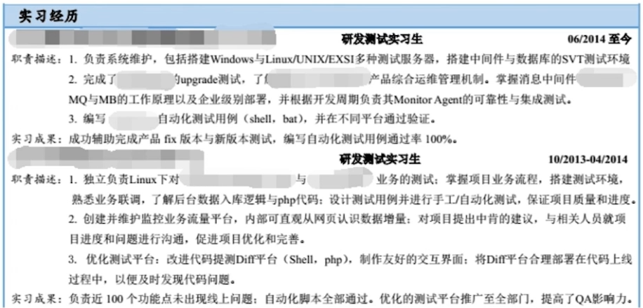

#### 第2章 一个输入框引发的血案

**问题：**测试以下***页面中的输入框***，你都会测试哪些内容？

<非压力面试中的开放式问题，获取更多关于技术能力、管理能力、沟通能力的信息>

**结构化思维：**

**①确认面试题目：**仅测试输入框or考虑页面全部内容 <倾听、理解、反馈>

**②测试输入框 大的范围and小的范围：**功能性测试（输入不同内容及其边界）、兼容性测试（选择机型、选择浏览器、页面问题） 、稳定性测试（压力下正常返回、多次查询返回内容稳定）、性能测试（QPS每秒钟处理请求数、搜索耗时情况、页面大小资源数量）、安全性测试（JS注入、SQL注入）、接口测试（查询正确性、对异常容错情况、非浏览器环境下处理）、线上监控（保证实时性、发现异常）、自动化测试（UI自动化、提高效率）

**扩展考核：**Linux、计算机网络、数据库、操作系统（Android、iOS）、算法、数据库（MySql、Redis、MongoDB）

#### 第3章 磨刀不误砍柴工-自我分析

**简历要表现什么：**技术能力、管理能力、学习能力、沟通能力、创新能力、团队协作

**如何做一个好的简历：**①文案简洁、格式清晰；②概括说明、重点突出；③多用数据和图表；④用真实工作环境中 积累的经历和经验 浓缩

**了解测试流程么：**需求沟通（与产品沟通功能含义、与开发沟通开发时限）→制定测试方案（依据需求）→设计测试用例→准备测试环境→测试执行→bug处理→回归验证→跟进上线→需求沟通

**了解bug处理流程么：**新建bug单（title、复现步骤、条件、截图） 待修改<to开发> 待验证<to测试> 无法修改<to产品> 误报<to测试 不是问题>

​								bug分级：优先级、严重程度；bug分类：UI、系统、接口；bug状态：上图状态

**沟通对象：**①产品、开发、UED；②市场、运维、运营；③领导、下属

**沟通方法：**①面对面沟通；②邮件沟通；③即时通讯（微信、QQ、电话、短信）

**常用测试工具：**①网络调试工具：Fiddler；②页面调试工具：Chrome Inspector、firebug；③WEB自动化工具：QTP、Selenium；④移动端工具：ADB、Monkey、MonkeyRunner；⑤移动端自动化框架：Appium、Robotium、uiautomator、selendroid；⑥平台知识：Windows（批处理）、iOS（IDB）、Android（借助win 进入手机系统操作）、Linux（命令行操作），进程、线程、CPU、内存；⑦服务端压力工具：接口压力测试 Loadrunner、JMeter；⑧数据库工具：MySQL

**如何设计测试用例、管理测试用例：**设计原则、设计方法、管理方式

**工作效率、成果：**如何安排任务、如何提高测试效率？工作中都有哪些成果？如何团队间协调工作？

**问题的背后意图：**通过问题看能力、通过回答看人品、通过表现看态度

**SWOT分析：**全面审视自己