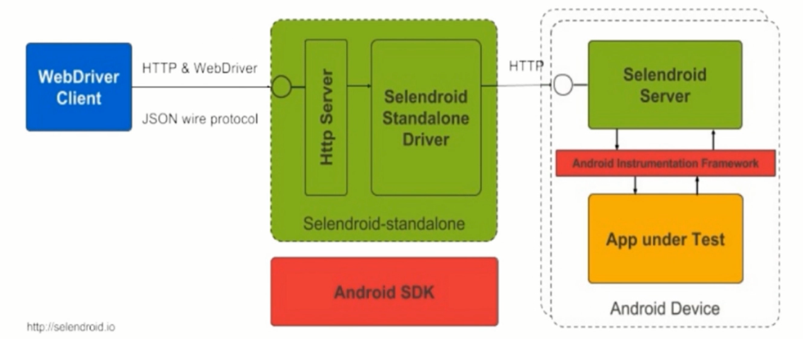

### **第12章：第一招式--移动端-自动化工具**

#### **Instrumentation<Java相关>：**

**原理**图：

①测试app和被测app（myAppTests.apk和myApp.apk）

需要***在一个进程下***，但通过不同线程完成测试操作，通过命名实现区分

②测试App通过Instrumentation技术控制被测App<直接***调用被测App的类***，调用代码实现自动化技术>

安卓系统通过InstrumentationTestRunner控制测试App

可采用Eclipse or 命令行执行测试用例，输出测试结果，需要源码

**测试目标：**功能性测试、Activity生命周期测试、模拟数据库操作的测试、兼容性测试

**使用场合：**采用Java Junit框架、进行白盒测试、使用Mock技术模拟系统对象时

#### **UIAutomator、UIAutomatorViewer：**

**原理：**Android UI自动化测试工具、不需要源码、基于Java开发语言、多种类库如下：

**测试目标：**App UI层的交互操作、不需要源码、可以模拟跨进程操作、基于Java JUnit框架、黑盒UI自动化

**如何识别App视图内的元素：**

UIAutomatorViewer工具<安卓sdk下tool文件夹中>--可识别元素的ID、classname、bounds等

#### **Selendroid、Robotium<测试Hybrid APP、需要依赖源码>：**

**Selendroid原理：**

Selendroid是基于Instrumentation做的封装，封装后叫Selendroid Server

Selendroid Server接收到测试指令后会转化成Instrumentation对应的方法，调用被测App

Selendroid Standalone Driver通过Http协议调动Selendroid Server

Http Server负责接收自动化测试脚本的指令

WebDriver Client--脚本实现过程中依赖的类库 通过JSON无线协议 与Http Server进行通信

**Selendroid四大组件：**

Selendroid Client：WebDriver<针对PC端web的驱动> + 移动特性的实现

Selendroid Server：Instrumentation APK

AndroidDriver-App：一个WebViewActicity，即浏览器

Selendroid-Standalone：大总管，负责准备环境

-----------------------------------------------------------------------------------------------------------------------------------------------------------

**Robotium原理：**

基于Instrumentation进行封装，实现Android测试框架，测试时需要源码

封装了一个Solo类库，提供自动化测试中全部相关API

#### **Appium<支持多种语言、常问、继承于Selenium>：**

**什么是Appium：**一个开源的移动端UI自动化测试框架

**理念：**不需要App源码，不局限于语言或者框架，接口统一、不需要重复开发，必须开源

**相关概念：**C/S架构，核心是web服务器；Session，客户端初始化session后与服务端交互，有固定session id，与具体App交互；Desired Capabilities，初始化时的键值对组合；Appium Server，操作与驱动手机；Appium Client，支持多语言调用；

**环境内容：**※Android SDK、JDK、Appium；Pycharm、Python环境；库：Selemium、Appium-Python-Client

**支持的开发语言：**Java、JavaScript、PHP、Python、Ruby、C#、Perl、Object C

**初始化配置内容：**platformName，目标设备平台Android/iOS；platformVersion，目标设备的平台版本；deviceName，目标设备名称；appPackage，App包名(Android、指定被测App)；appActivity，App Activity名称(Android)；automationName，自动化驱动类型Seledroid/Appium；unicodeKeyboard，是否使用Appium输入法；resetKeyboard，是否恢复默认键盘；

**测试Native App的原理<App内所有操作、元素都是Java实现>：**

前提：自动化工具(安卓自带--Android UIAutomator--基于Java)可以驱动被测App；appium支持多语言，从而可以采用Python脚本进行测试；Appium基于UIAutomator做了一层封装 

 **测试Hybrid App的原理<Java实现+html实现，如浏览器>：**Appium基于selendroid做了一层封装

 **测试iOS App的原理：**

Appium基于WebDriverAgent做了一层封装，WebDriverAgent实际控制XC UITest框架，再与被测App进行交互

API（Application Programming Interface，应用程序接口）

#### **如何自动化测试Native App：**

**元素的定位、识别工具：**首选UIAutomatorViewer；其次可选Appium的Inspector

**定位元素的API：**find_element_by_accessibility_id; find_element_by_id; find_element_by_name; find_element_by_xpath; find_element_by_class_name; 

复数形式定位多个元素、再进行遍历：find_elements_ …

**脚本的编写规则：**LOVE规则=Locate(定位元素)+Operate(操作)+Verify(验证)+Exception(异常处理)

**初始化注意事项：**不需要指定App的包路径；默认使用Appium驱动；输入中文字符需添加输入法相关配置；

#### **如何自动化测试Hybrid App<Native app+H5>：**

**元素的定位、识别工具：**Native部分同上，WebView部分采用Chrome浏览器的调试模式

**定位元素的API：**find_element_by_id<切换至WebView状态下>; find_element_by_name; find_element_by_xpath<html中元素>; find_element_by_link_text; find_element_by_tag_name; find_element_by_class_name; 复数形式定位多个元素、再进行遍历：find_elements_ … 在html中常见

**脚本的编写规则：**S-LOVE规则----Switch+Native规则

**初始化注意事项：**明确指定驱动为Selendroid；需要明确指定App路径、因为需要重签名；

#### **如何使用Selenium测试WEB页面<多为H5>：**

**环境准备：**工具：Pycharm、Chrome；包：Selenium、Python；WebDriver：Chrome driver/Firefox driver/ie driver

**元素识别工具：**Firefox或Chrome的开发者调试工具

**元素定位方法：**同Hybrid App测试 定位API ***关注测试实例***

#### **如何使用Appium测试WAP页面：**

**环境准备：**IDE：Pycharm；包：Python、Selenium、appium-python-client；工具：Appium、Chrome

**元素识别：**Chrome浏览器调试WAP页面

**脚本编写：**初始化时，指定browsername为：Browser；自动化测试代码和selenium相同；

***关注测试实例***

#### **WEB页面和WAP页面区别：**

①访问媒介不同：wap(Wireless Application Protocol)是无线应用协议的缩写，一种实现移动电话与互联网结合的应用协议标准，wap网站主要是用手机访问；WEB(World Wide Web)即全球广域网，它是一种基于超文本和HTTP的、全球性的、动态交互的、跨平台的分布式图形信息系统，web网站主要是用电脑访问。

②便捷程度不同：手机上网的方便、及时这些优点，使wap网站不可避免的成为了一种流行，WAP手机可以通过标准的协议接入互联网，手机上网，可以获取适用于手机浏览的网上信息，以及基于互联网的丰富应用；相比电脑访问的web来说手机访问就是很方便快捷非访问方式了，给生活带来了很多的便利。

③本质不同：WEB指的是计算机领域的网站及相关技术，WAP指无线设备的网页协议，也就是手机网站，目前最新的是H5手机网页，大多数网站都实现了手机网站和PC网站内容互通，最热门的应该是响应式网站。