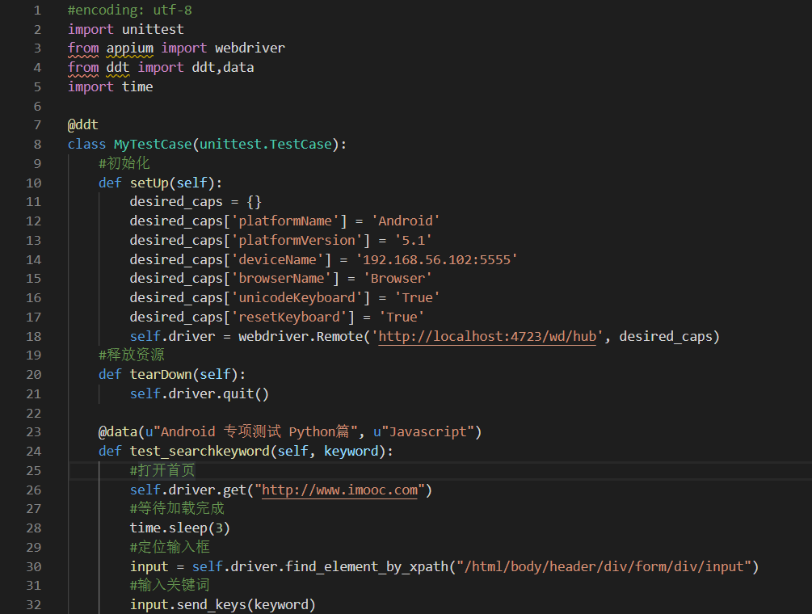
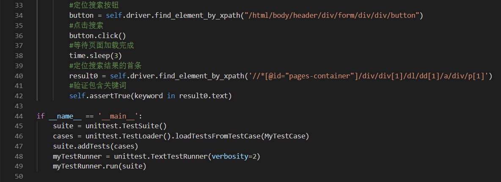
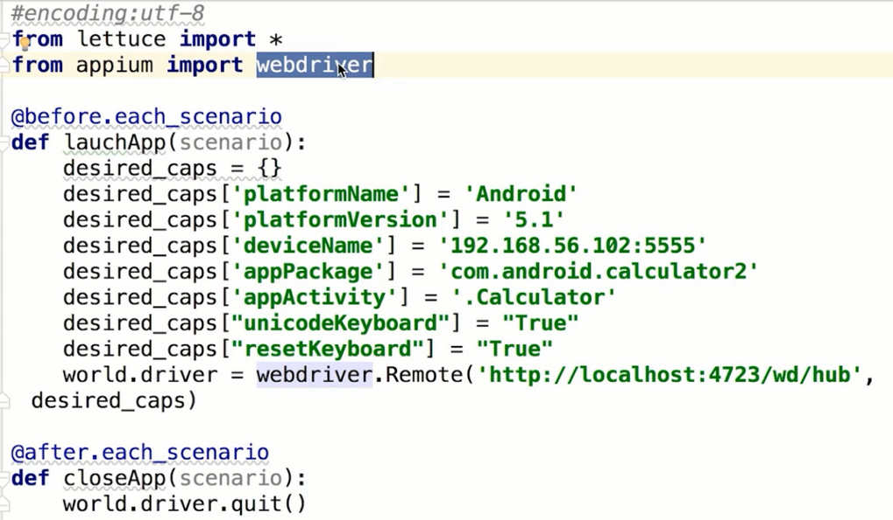
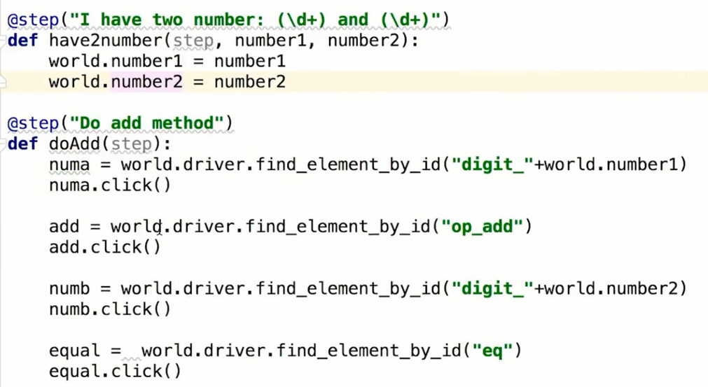
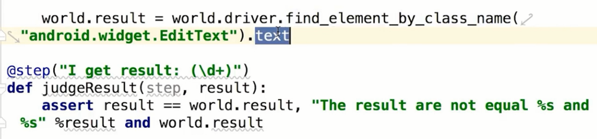
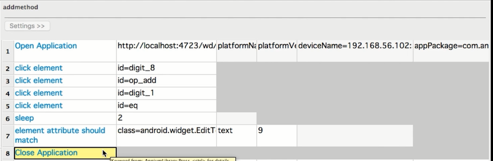
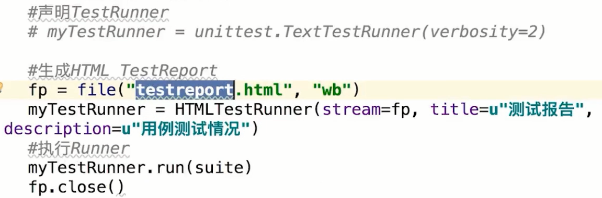

### **第13章：第二招式--自动化框架**

#### **unittest原理：**

**unittest框架内容：**<单元测试>

TestFixture、TestCase、TestSuite、TestRunner

TestFixture（测试的固定装置）包含SetUp（用例初始化过程）、TestCase（实际具体执行的测试用例）、TearDown（资源释放过程）

TestCase（测试用例）命名必须以test开头，否则会被当作普通函数执行

TestSuite（测试套件）用来容纳测试用例的容器，声明时为空，后续添加内容

TestRunner：执行测试用例

#### **DDT-数据驱动：**

**什么是数据驱动：**数据驱动测试即黑盒测试，又称为功能测试；数据驱动单元测试为数据源中的每行重复进行一种单元测试，常用情况是使用多个输入值测试API

**原理：**Python下数据驱动框架叫DDT(Data-Driven Tests)；基于unittest实现；使用多个数据运行一条用例，使其表现为多条用例；原理是通过Python装饰器对用例进行装饰

**如何使用DDT测试搜索功能：**模拟在慕课网搜索不同关键词    @ddt @data 装饰器

**数据驱动测试的意义：**代码复用率高，一次编写多条数据复用逻辑；异常排查效率高，测试执行隔离，数据间无影响；代码可维护性高，提高代码易读性；

#### **Lettuce-行为驱动：**

**什么是行为驱动：**Behavior-Driven Development，简写BDD；在软件工程中，BDD是一种敏捷软件开发的技术

**原理：**Lettuce是基于Python语言的行为驱动测试框架，将测试用例和自动化测试代码分离，写测试用例非常清晰

**行为驱动的实现：**测试实例

----feature文件夹相当于unittest中的suite套件，test.feature中可以定义需要的测试用例，一个用例对应一个Scenario

----采用lettuce命令进行测试，而非运行py文件

#### **KDT-关键字驱动：**

**什么是关键字驱动：**关键字驱动测试也称为表格驱动测试<表格形式管理>或行为驱动测试，将创建测试程序的步骤分为规划及实现两个阶段，关键字驱动使不懂代码的人可以完成自动化过程，灵活性较差

**原理：**所用框架--Robot Framework，基于RIDE可视化工具<根据测试对象不同，需要选择不同库>，测试手机App，需导入AppiumLibrary；使用AppiumLibrary中提供的关键字，实现关键字驱动测试用例；使用RIDE可视化工具能完成测试用例的执行与结果的管理；

**关键字驱动的实现：**参考模拟代码实现

RIDE-New Project-New Suite-导入AppiumLibrary包-New Test Case-Settings-工具栏选择关键字-设置参数

返回Report，html文件，可在浏览器中查看非常详细的测试信息

#### **生成测试报告：**

**如何收集测试结果：**使用HTMLTestRunner.py生成HTML测试报告，把HTMLTestRunner.py放在代码文件同一目录下

import HTMLTestRunner

**如何管理测试报告：**以时间戳作为报告的名称

#### **测试邮件通知：**

**定义邮件服务：**以网易邮箱为例；开启授权-SMTP服务

**自动发送测试报告：**使用SendReport.py发送测试报告；mail_pass-邮箱密码和授权密码-填授权密码

from SendReport import send_mail

