#### 第4章 基于Python语言常见的问题

**46.测试阶段的划分：**<开发>单元测试（代码级别）、集成测试（模块结合）、<测试>系统测试、验收测试

**47.测试的流程：**需求沟通（与产品沟通功能含义、与开发沟通开发时限）→制定测试方案（依据需求）→设计测试用例→准备测试环境→测试执行→bug处理→回归验证→跟进上线→需求沟通

**48.如何做好测试计划：**5W原则——What（测试什么）、Why（测试目标）、When（项目起止时间）、hoW（测试方案）、Where（资料位置）

**49.常见的测试用例设计方法：**

1.等价类划分法：将测试的范围划分成几个互不相交的子集，从每个子集选出若干个有代表性的值作为测试用例

2.边界值分析法：大量的错误是发生在输入或输出范围的边界上，因此针对各种边界情况设计测试用例，可以查出更多的错误。选出的测试用例，应选取正好等于、刚刚大于、刚刚小于边界的值。

3.错误推测法：依赖经验or直觉进行推测，，从而有针对性地编写检查这些错误的测试用例的方法。

4.正交表分析法：被测试条件有多种，选择一部分典型数据作为测试条件。

5.场景分析法：依赖操作事件流。登录、购买→成功、失败。

6.因果图法：输入条件的相互组合

**50.bug记录包含内容：**

1.测试工程师、开发人员、bug日期

2.bug标题、bug正文、bug附件

3.bug优先级、bug严重程度

4.bug所属模块

5.bug状态（新建、已修复、已验证、遗留等）

6.bug处理记录

**51.如何分层自动化测试：**UI自动化回归、接口自动化、单元测试-白盒测试<依据项目需求进行分层测试、依据不同情况选择不同自动化方法>

**52.如何保证脚本有效性**：

定位有效（封装处理异常）、流程有效（封装独立方法）、数据有效（数据备份与恢复）

**53.如何降低自动化维护成本：**

UI自动化 针对不常变化的页面；接口自动化 周期短变动频繁的页面；框架分层 用例与框架分离

**54.常见测试覆盖类型：**<白盒测试> 语句覆盖、判定覆盖、条件覆盖、判定/条件覆盖、条件组合覆盖、路径覆盖

**55.B/S和C/S架构的区别：**

C/S--Client/Server--客户/服务器模式 如杀毒软件；B/S--Browser/Server--浏览器/服务器模型 如慕课网网站

**56.安全性测试包含内容：**

用户访问认证、传输数据加密、安全防护策略、数据备份恢复、防病毒系统、SQL注入、JS注入

**57.测试报告包含内容：**测试的背景、范围、环境、方法、结果结论、质量或风险评估

**58.Alpha测试和Beta测试区别：**

*Alpha测试：*在开发环境下进行测试；Beta测试：在用户真实环境测试，通过后发布

**59.bug类型：**①Bug：代码编写错误导致的功能问题；②Defect：缺陷，实现与需求不一致；③Fault：故障，系统问题引起运行失败；④Error：错误，语法or逻辑错误

-----------------------------------------------------------------------------------------------------------------------------------------------------------

**60.面向对象概念：**

面向对象编程OOP，一种程序设计思想；类、继承、多态<子类方法覆盖父类方法>、实例、属性、方法

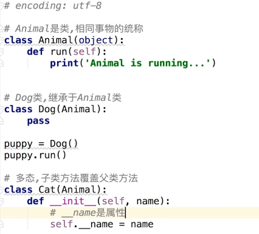

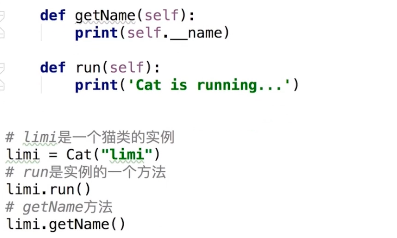

**61.进程、线程、协程：**

进程：独立数据空间，进程间不共享数据，系统调度；

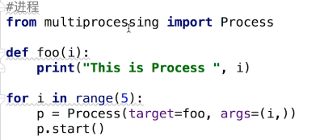

线程：执行程序的最小单元，进程内线程间共享资源，系统调度；

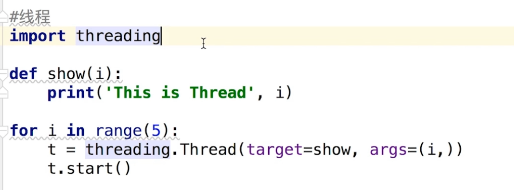

协程：分解线程，程序员调度；

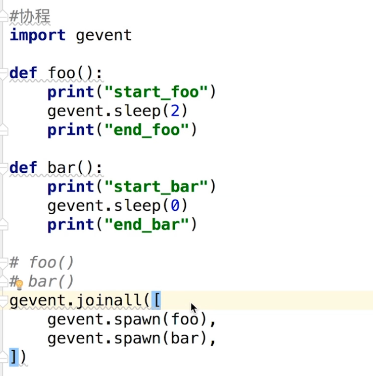

**62.使用Python实现Socket编程：**

应用程序通过socket向网络发出请求or应答网络请求，使主机间或者进程间可通讯

服务器端：

客户端：

**63.lambda函数：**没有函数名的函数，用于只用一次、定义方法效率低的情况

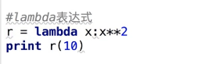

**64.tuple和list区别：**tuple元组，元组内元素不可单独改，整个元组可改；list列表，元素可修改

**65.range函数：**可生成一个列表对象、返回一系列连续增加的函数

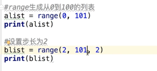

**66.字符串拆分方法：**

①string对象的split方法，不允许有多个分隔符；②函数re.split()，允许为分隔符指定多个正则模式

**67.单引号、双引号、三引号的区别：**单双引号无区别，都可用来表示字符串；三引号字符串内可换行

**68.args和kwargs作用：**args表示可变的参数列表，kwargs表示键值对参数列表

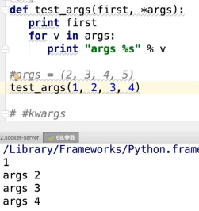

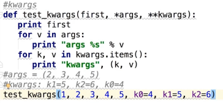

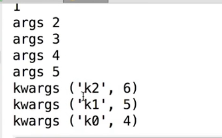

**69.pass语句：**占位符，实现一个空函数

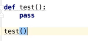

**70.re模块中match和search方法的区别：**

search扫描整个字符串查找匹配；match只在字符串开始位置匹配；group方法输出查询内容 

**71.WSGI和FastCGI的关系：**

CGI--公共网关接口，http服务器与机器上的程序进行交互的工具，程序需运行在网络服务器上，和语言无关。

WSGI--网页服务器网关接口，Python应用程序和WEB服务器之间的一种接口。

FastCGI--常驻型CGI，可一直执行，让后台服务处理更加高效。

**72.Python操作文件：**打开、写入/读取、关闭

**73.Python的内存管理机制：**引用计数<from sys import getrefcount>、垃圾回收、内存池

**74.dict的items与iteritems区别：**

items方法以列表形式返回，无特殊顺序；iteritems方法返回迭代器对象<next方法对迭代器访问返回值>

#### 第5章 基于Python常问排序算法

有项目不再考察算法 对算法具体提问 或逻辑思维题目现场发挥 想清楚原理 才能写明白算法

**75.排序：**从小到大排序：sorted(list)；从大到小排序：sorted(list,reverse=True)；.sort()改变列表内容

**76.冒泡：**比较相邻元素，大小关系不对就交换位置；一轮遍历，最大放队尾；不包括已经排队尾的，重复进行第二次遍历…实现排序本身

**77.快排：**！！！挑出基准值key；小于key的元素放左侧，大于key的元素放右侧；左右侧分别进行递归

**78.堆排序：**近似完全二叉树结构、子结点值小于父结点值--大值堆、大于--小值堆

 ！！！

**79.二分查找：**折半查找，必须采用顺序存储结构、必须关键字大小按序排列

**80.素数：**质数，0、1不是，除1和本身不能被其他数整除

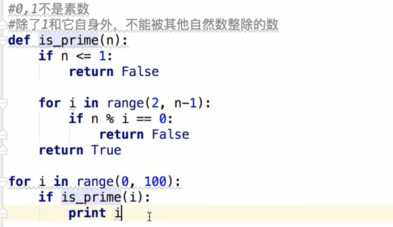

