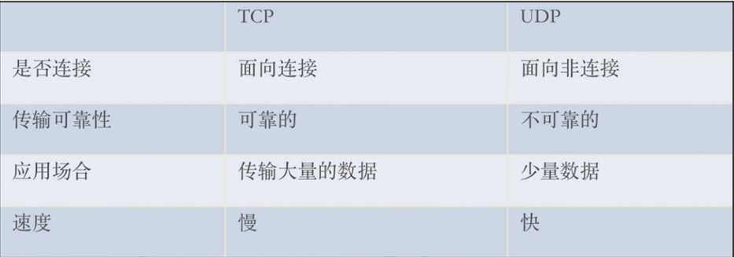

#### **第6章：Linux常用命令**

**基础命令：**

cd切换目录；ls -l列出文件详细信息；ls -a列出当前目录下所有文件；touch创建文件；mkdir创建目录；

echo创建带有内容的文件；cat查看文件内容；cp拷贝；clear清屏；

mv移动或重命名；rm -r递归删除；rm -f强制删除；wc统计文本中行数、字数、字符数；

grep在文本文件中查找某个字符串；<未安装>tree显示目录结构；ln创建软链接；

more、less分页显示文本内容；head、tail显示文件头尾内容

**网络命令：**

curl利用URL规则在命令行下工作的文件传输工具<实现浏览器内一些功能>；

netstat显示网络状态信息；telnet用于登录远程主机；

**系统命令：**

ping测试网络连通；man查看帮助；kill杀死进程；kill+pid序号

top动态显示当前耗费资源最多进程信息；ps显示瞬间进程状态；df查看磁盘大小；df -h带有单位显示磁盘信息

#### **※第7章：计算机网络相关问题**

**OSI七层模型（Open System Interconnection）：**

①物理层：建立、维护、断开物理连接；②数据链路层：逻辑连接、硬件地址寻址、差错校验；

③网络层：逻辑地址寻址、不同网络之间的路径选择、IP；④传输层：传输数据的协议，TCP、UDP<可能丢包>；

⑤会话层：建立、管理、终止会话，本地与远程主机会话；⑥表示层：数据的标示、安全、压缩，JPEG、ASCII等；⑦应用层：与最终用户的接口，HTTP、HTTPS、SMTP等；

**※http协议中get、post的区别：**

功能差异：get--客户端去服务器取内容；post--从客户端向服务器提交、上传数据；

数据传输：get--通过在url中加入参数<在浏览器网址中可见>；post--数据放在body里面

安全性：post相对更安全，但对关键信息需加密

重要，在测试过程中需要抓包分析，get、post需重点理解应用

**TCP和UDP区别：**

面向连接：http协议，浏览器访问站点；面向非连接：微信QQ离线接受数据；

**TCP连接三次握手过程<建立连接>：**

**TCP连接四次挥手过程<断开连接、客户端和服务器双方均可发起>：**

**socket建立连接过程：**

服务器建立监听：socket、bind、listen；客户端发送请求：connect、send；连接确认：accept、response

#### **※第8章：操作系统相关问题**

**进程与线程的区别：**

进程：具有独立数据空间，进程间不共享数据，系统调度；

线程：执行程序的最小单元，进程内线程间共享资源，系统调度；

一个进程可以有多个线程，多个线程也可以并发执行。

**进程的状态：**

就绪状态：已获除处理机外所需资源，等待分配处理机资源

运行状态：占用处理机资源运行，进程数<=CPU数

阻塞状态：进程等待某种条件，在条件满足之前无法执行

**进程同步与互斥的区别：**

互斥：某一资源同时只允许一个访问者对其进行访问；唯一性、排他性、访问无序性；

同步：基于互斥，访问有序；大多数情况下同步已实现互斥，写入资源是互斥的；

**进程间通信：**

管道：半双工通信方式，数据单向流动，父子进程间；

命名管道：半双工通信方式，无亲缘关系进程间通信；

信号量：计数器，锁机制，控制多进程对资源访问；

消息队列：消息链表，存放在内核中由消息队列标识符标识；

信号：比较复杂的通信方式，通知进程某个事件已经发生；

共享内存：映射一段能被多个进程访问的内存；

**进程的调度算法：**

先来先服务（First Come First Service）、短作业优先（Shortest Process Next）、时间片轮转调度算法（Round Robin）、高响应优先（Highest Response Ratio Next）、优先权调度算法、多级队列调度算法

**死锁产生原因：**资源竞争、进程推进顺序不当；

产生必要条件：互斥、不剥夺、请求与保持、环路等待；

预防死锁：破坏四个必要条件之一；

**页面置换算法：**

最佳置换算法：一直未被使用内存页会最先被置换；

先进先出置换算法：堆栈

最近最久未使用置换算法：时间戳、现在时间与进入时间的差、时间差最长的最先被置换；

Clock置换算法（最近未使用算法）：对每一个内存页加标识符，被使用置为1，为0被置换；

最少使用置换算法：距离现在最少使用的内存页会被置换

**makefile<定义好规则的脚本文件，用make工具解析执行>的作用：**

定义、指定编译规则（哪些先编译、后编译、重新编译），自动化编译，需要make工具解释执行。

**虚存、实存、共享内存：**

虚存：进程需要的虚拟内存大小，按申请内存计算；

实存：实际使用的内存大小，虚存包含实存，按实际使用计算；

共享内存：包含整个共享库大小，即使只使用一部分；某进程所占物理内存大小：实存(RES) - 共享内存(SHR)

**※如何创建数据库：**

create databse 数据库名；创建数据库

show databases；显示全部数据库

drop database 数据库名；删除数据库

**※如何创建数据表：**

use 数据库名；采用某个数据库

create table 表名；创建数据表，同时创建id和name两个字段

show tables；显示数据库下的全部数据表；

**※如何操作数据表中的数据：**

insert into 表名 values(内容)；插入内容

select * from 表名 where 条件；查询内容

update 表名 set 字段=新值 where 条件；更新内容

drop table 表名；删除数据表