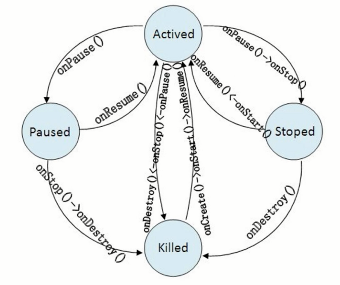
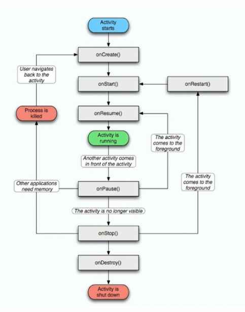

#### **第9章：Fiddler工具-功能**

**抓取手机包：**

保证手机和PC在同一局域网下，设置代理转发，将手机数据流转发至PC端Fiddler工具上；

选项Allow remote computers to connect需勾选；

**配置fake response、fake request，数据包request、response中字段含义：**

fake response：在AutoResponder选项卡中设置--Add Rule--Rule Editor--Find a file；

保存html文件，notepad打开，进行修改；修改返回内容，只对自己可见，不影响他人，完成测试任务

fake request：在Composer选项卡中设置--GET从服务器拿取数据，POST向服务器发送数据，借助Fiddler工具执行execute，向服务器传输数据

**实现慢网速：**

Rules--Performance--Simulate Modem Speeds，采取慢网速模式；

or

FiddlerScript选项卡--Go to OnBeforeRequest--找到SimulateModem模块，进行数字修改；

**抓取数据过多--过滤：**

Filters选项卡，修改following hosts（无需添加网址前缀），对目标网址进行过滤；

**不同状态码：**

AutoResponder选项卡中进行选择——200类表示成功状态，300类和跳转相关，400类和客户端相关，500类和服务器端相关

#### **第10章：ADB相关问题**

**Android四大组件：**Activity--程序与用户的交互窗口；Service--在程序后台完成用户的操作；ContentProvider--提供数据的统一访问格式；BroadcastReceiver--应用程序之间传输信息的机制；

**Activity生命周期：**激活状态、暂停状态、停止状态、被杀掉状态；Activity只能决定自己什么时候出生，不能决定什么时候被杀死；

**什么是ANR：**

Application Not Responding，应用无法响应，Activity最长执行时间是5s，系统监控，用户可选择“继续等待”或“强制关闭”

**Android常见五种布局：**

FrameLayout（框架布局）、LinearLayout（线性布局）、AbsoluteLayout（绝对布局）、RelativeLayout（相对布局）、TableLayout（表格布局）

**Android中动画类型：**

Tween动画：组件移动、缩放、透明度的变化

Frame动画：通过顺序播放实现，类似电影

**如何重启adb服务：**

adb kill-server：停止服务；adb start-server：启动服务

**APP安装与卸载<采用PC对Android模拟器进行操作>：**

安装：adb -s <devicename> install <path-to-apk>

覆盖安装：adb -s <devicename> install -r <path-to-apk>

卸载：adb -s <devicename> uninstall <packagename>

**在电脑和手机之间传输数据<PC是主角，从A到B>：**

adb push D:\test.apk /data/local/tmp/test.apk 从PC到手机，发送

adb pull /data/local/tmp/test.txt D:\ 从手机到PC，拉取

**静默安装APP<安装时无需任何用户干预，直接按默认设置安装>：**

adb shell pm install -f /data/local/temp/test.apk

**使用adb启停APP：**am--activity manager

启动：adb shell am start -W -S package/activity

停止：adb shell am force-stop package

**通过关键字查找已安装的包：**pm--package manager

adb shell pm list package -f keyword <查找手机内全部含关键字的包>

adb shell pm list package -i keyword <查找手机内已安装的包>

adb shell pm list package -3 keyword <查找手机内第三方安装的包>

**截屏、录屏：**报bug时有帮助，截取之后存入手机路径

截屏：adb shell screencap /data/local/tmp/screen.png

录屏：adb shell screenrecord /data/local/tmp/demo.mp4

**抓取logcat日志：**

adb logcat; adb shell logcat

**获取当前CPU、内存状态：**Windows findstr命令=Linux grep命令<过滤作用>

内存：adb shell dumpsys meminfo package

CPU：adb shell dumpsys cpuinfo | findstr package

#### **第11章：monkey相关问题**

**monkey进行压力测试的命令--随机测试：**

adb shell monkey (-v -v -v) (-s seed) (--throttle time) (--ignore-crashes --ignore-timeouts) (--pct-touch 执行次数) -p <packagename> <count>

**如何重现Crash、ANR过程：**monkey是伪随机过程，基于一定参数进行模拟

添加参数 -s seed--采用相同seed值可复现，保证操作序列一致（在一定程度上，特殊因素不可控）

**如何提取Crash、ANR信息：**将monkey执行过程中的日志重定向到文件，从文件中过滤信息。-v

测试版app连接第三方统计平台

**如何设置monkey运行8个小时：**添加参数 --throttle 设置事件间隔 暂时忽略触发事件耗时

**monkey在crash/ANR后，如何继续执行：**

添加忽略Crash参数 --ignore-crashes；添加忽略ANR参数 --ignore-timeouts

**如何让monkey执行指定事件：**

触摸事件 --pct-touch；动作事件 --pct-motion；轨迹球事件 --pct-trackball；基本导航事件 --pct-nav；主要导航事件 --pct-majornav；系统导航事件 --pct-syskeys；应用启动事件 --pct-appswitch；其他类型事件 --pct-anyevent；

